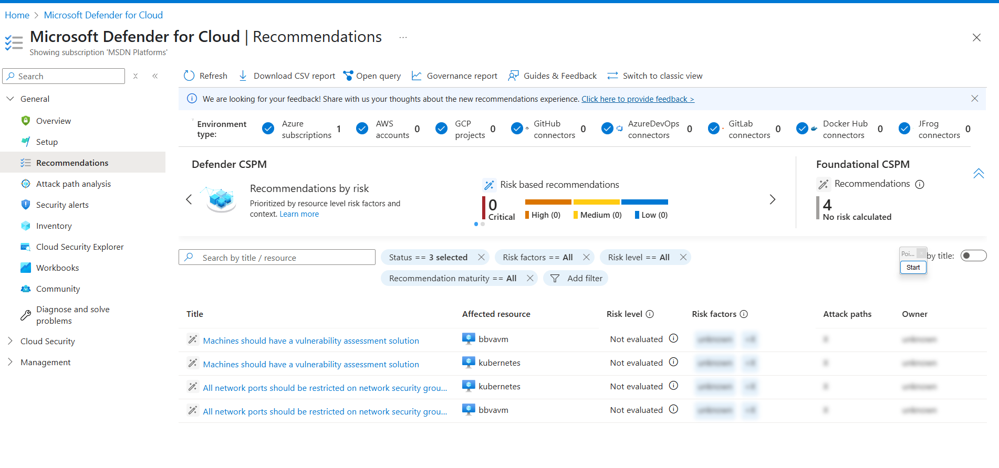
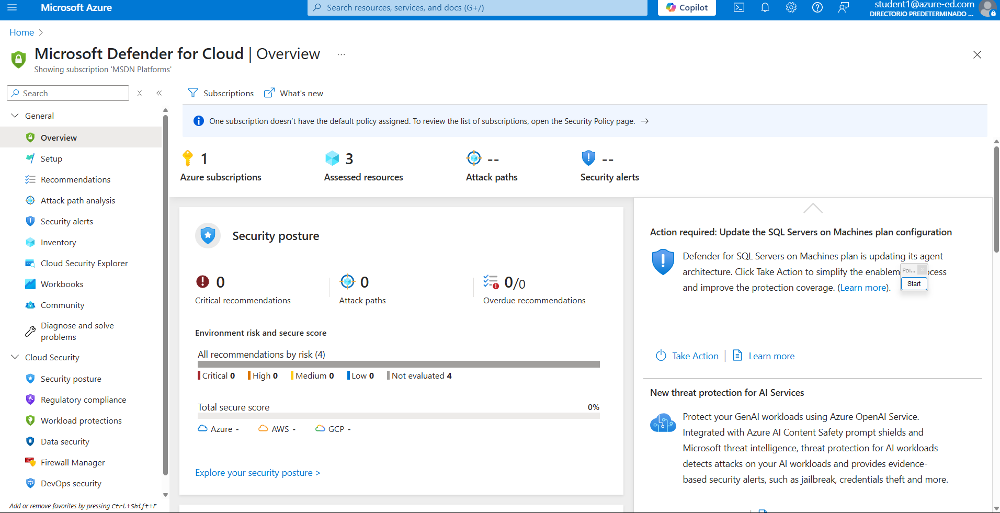

# Práctica 9. Explorando opciones de seguridad en la Nube con Azure Security Center

En esta práctica el alumno observará, las opciones de seguridad en Azure usando Defender for Cloud.

## Objetivos de la práctica:
- Entender las opciones de seguridad ofrecids por Azure. 
- Navegar en Defender for cloud para entender las recomendaciones de seguridad en Azure. 

## Duración aproximada:
- 30 minutos.

---

        <table width="50%">
            <tr>
                <td style="text-align: center;">
                    
                     Anterior
                </td>
                <td style="text-align: center;">
                   <a href="https://netec-mx.github.io/DEVSECOPS_JAV/">Lista de laboratorios</a>
                </td>
<td style="text-align: center;">
                    
                     Siguiente
                </td>
            </tr>
        </table>

---

## Objetivo visual:

## Instrucciones
> **IMPORTANTE:** Para realizar esta práctica es importante tener una cuenta de Azure con el rol de **Security Reader.**

1. Abre el siguiente enlace **https://portal.azure.com**

2. Inicia sesión con tu cuenta de Azure con los permisos necesarios. 

3. En la barra de búsqueda escribe **Security** (para entrar a las opciones de Seguridad de Azure).

4. Entra a **Security Center**. 

5. Selecciona el vínculo de **Microsoft Defender for Cloud**.

6. En la herramienta encontraremos 3 opciones: 

- **General:** En esta sección podremos observar el estado de seguridad y recomendaciones generales de nuestra suscripción.

- **Cloud Security:** Aquí se configuran y visualizan los servicios de seguridad específicos por tipo de recurso. 

- **Management:** Opciones para gestionar la configuración global de Defender for Cloud. 

7. Abre las recomendaciones de seguridad para nuestra suscripción **General->Recommendations**

> **NOTA:** Observa las recomendaciones y analizar su posible solución. Recuerda que sólo tienes permisos de lectura. 

8. En la sección de **Cloud Security** se encuentran las siguientes opciones: 

- **Security posture**
Objetivo: Visualizar el estado general de seguridad de tu entorno.

    - Incluye:

        - Secure Score: Puntuación basada en recomendaciones aplicadas.

        - Recomendaciones por categoría (identidad, red, almacenamiento, etc.)

        - Recursos afectados y su nivel de riesgo.

- **Regulatory compliance**
Objetivo: Verificar si tus recursos cumplen con estándares como:

    - ISO 27001
    - NIST 800-53
    - CIS Controls
    - GDPR

- **Workload protections**
Objetivo: Activar y administrar planes de protección (Defender plans) para distintos tipos de cargas de trabajo como:

    - Máquinas virtuales
    - Kubernetes (AKS)
    - Bases de datos
    - Azure App Services

- **Data security**
Objetivo: Proteger los datos en reposo y en tránsito.

    - Incluye:

        - Evaluaciones sobre cifrado, acceso y etiquetado de datos.
        - Alertas por acceso no autorizado o configuraciones incorrectas.

- **Firewall Manager**
Objetivo: Centralizar la administración de firewalls (especialmente Azure Firewall).

    - Incluye:

        - Reglas de red, filtrado DNS, protección contra amenazas.
        - Políticas aplicadas a redes virtuales.

- **DevOps security**
Objetivo: Integrar la seguridad en el ciclo de vida del desarrollo.

    - Incluye:

        - Escaneo de código, infraestructura como código (IaC) y pipelines.
        - Detecta vulnerabilidades y malas prácticas antes del despliegue.

## Resultado esperado
Si el alumno ha llegado hasta aquí, tiene una mejor idea del funcionamiento de Security Center de Azure y sus opciones de seguridad.

