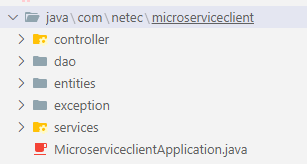

# Práctica 2. Análisis de seguridad y códificación de un API Rest Spring Boot

En este laboratorio se espera que desarrolles una API REST utilizando Spring Boot, aplicando buenas prácticas de seguridad en el proceso. Además, deberás realizar análisis de código con herramientas como Snyk y SonarQube, con el objetivo de identificar posibles vulnerabilidades.

## Objetivos:

Al finalizar la práctica, serás capaz de:
- Desarrollar un API RESTful aplicando las buenas prácticas en el diseño de código con Spring Boot. 
- Analizar nuestro código usando:
	- snyk para buscar vulnerabilidades, y
 	- SonarQube para la busqueda de vulnerabilidades en nuestro código.

---
<!--Este fragmento es la barra de 
navegación-->

<div style="width: 400px;">
        <table width="50%">
            <tr>
                <td style="text-align: center;">
                    <a href="../Capitulo2/"></a>
                    <br>anterior
                </td>
                <td style="text-align: center;">
                   <a href="../README.md">Lista Laboratorios</a>
                </td>
<td style="text-align: center;">
                    <a href="../Capitulo4/"></a>
                    <br>siguiente
                </td>
            </tr>
        </table>
</div>

---

## Objetivo visual:


## Instrucciones
> **IMPORTANTE:** Antes de iniciar el laboratorio es necesario tener una cuenta de **gmail** y una cuenta **github** para el registro de las herramientas. 

Este laboratorio esta separado en las siguientes secciones:

- **[Códificar Microservicio Client](#códifica-microservicio-client-return)**
- **[Análisis de seguridad de código con SNYK](#análisis-de-seguridad-de-código-snyk-return)**
- **[Análisis de seguridad de código con SONARQUBE](#análisis-de-seguridad-de-código-con-sonarqube-return)**

### Códifica Microservicio Client [return](#instrucciones)

1. Abrir Visual Studio Code.
2. Pulsar la combinación de teclas **ctrl+shift+p** para abrir la paleta de comandos.
3. Buscar la opción **Spring initializr: Create a Maven Project**.
    - **Spring Boot Version:** 3.4.5
    - **Specify project language:** java
    - **input group id:** com.netec
    - **Artifact id:** microserviceclient
    - **Packaging type:** Jar
    - **Java version:** 17
    - **Dependencies:**
        - **Spring Web**
        - **Spring Boot DevTools**
        - **Spring Data JPA**
        - **MySQL Driver**
    - **Abrir proyecto**

4. Crear los siguientes paquetes para organizar nuestra arquitectura. 



5. En el paquete **entities** añadir el siguiente código. 

```java
package com.netec.microserviceclient.entities;

import jakarta.persistence.Column;
import jakarta.persistence.Entity;
import jakarta.persistence.GeneratedValue;
import jakarta.persistence.GenerationType;
import jakarta.persistence.Id;
import jakarta.persistence.Table;

@Entity
@Table(name="data")
public class Client {

    @Id
    @GeneratedValue(strategy = GenerationType.IDENTITY)
    private long id;
    
    @Column(length = 50)
    private String name;

    @Column(length=100)
    private String address;

    @Column(length = 150)
    private String email;
    public long getId() {
        return id;
    }
    public void setId(long id) {
        this.id = id;
    }
    public String getName() {
        return name;
    }
    public void setName(String name) {
        this.name = name;
    }
    public String getAddress() {
        return address;
    }
    public void setAddress(String address) {
        this.address = address;
    }
    public String getEmail() {
        return email;
    }
    public void setEmail(String email) {
        this.email = email;
    }
    @Override
    public String toString() {
        return "Client [id=" + id + ", name=" + name + ", address=" + address + ", email=" + email + "]";
    }
}
```

6. Añadir en el paquete **dao** el siguiente código: 

```java
package com.netec.microserviceclient.dao;

import org.springframework.data.repository.CrudRepository;

import com.netec.microserviceclient.entities.Client;

public interface IMicroserviceDAO  extends CrudRepository<Client, Long>{

}
```

7. En el paquete **exceptions** añadir el siguiente código:

```java
package com.netec.microserviceclient.exception;

public class ClientNotFoundException extends RuntimeException {
    public ClientNotFoundException(String message){
        super(message);
    }

}
```

8. En el paquete **services** añadir el siguiente código: 

```java
package com.netec.microserviceclient.service;

import java.util.List;

import com.netec.microserviceclient.entities.Client;

public interface IService {
    boolean insert(Client cl);
    List<Client> findAll();
    Client findById(long id);
    boolean deleteById(long id);
    boolean update(Client cl);
}
```

```java
package com.netec.microserviceclient.services;
import java.util.List;

import org.springframework.beans.factory.annotation.Autowired;
import org.springframework.stereotype.Service;

import com.netec.microserviceclient.dao.IMicroserviceDAO;
import com.netec.microserviceclient.entities.Client;
import com.netec.microserviceclient.exception.ClientNotFoundException;

@Service
public class ServiceImpl implements IService{

    public String jdbcURL="jdbc:mysql://localhost:3306/db";

    @Autowired
    private IMicroserviceDAO dao;

    @Override
    public boolean insert(Client cl) {
        if(cl.getId()==0){
            return dao.save(cl)!=null;
        }

        return false;
    }

    @Override
    public List<Client> findAll() {
        return (List<Client>) dao.findAll();
            
    }

    @Override
    public Client findById(long id) {
       return dao.findById(id)
       .orElseThrow(()->new  ClientNotFoundException("client desn't exists "+id));
    }

    @Override
    public boolean deleteById(long id) {
        if(dao.existsById(id)){
            dao.deleteById(id);
            return true;
        }
        throw new ClientNotFoundException("client doesn't exists "+id);
    }

    @Override
    public boolean update(Client cl) {
        if(dao.existsById(cl.getId())){
           return dao.save(cl)!=null;
        }
        throw new ClientNotFoundException("client doesn't exists "+cl.getId());
    }
}
```

9. Añadir en el paquete **controller** el siguiente código:

```java
package com.netec.microserviceclient.controller;

import java.util.List;

import org.slf4j.Logger;
import org.slf4j.LoggerFactory;
import org.springframework.beans.factory.annotation.Autowired;
import org.springframework.http.HttpStatus;
import org.springframework.http.ResponseEntity;
import org.springframework.web.bind.annotation.DeleteMapping;
import org.springframework.web.bind.annotation.GetMapping;
import org.springframework.web.bind.annotation.PostMapping;
import org.springframework.web.bind.annotation.PutMapping;
import org.springframework.web.bind.annotation.RequestBody;
import org.springframework.web.bind.annotation.RequestMapping;
import org.springframework.web.bind.annotation.RequestParam;
import org.springframework.web.bind.annotation.RestController;

import com.netec.microserviceclient.entities.Client;
import com.netec.microserviceclient.exception.ClientNotFoundException;
import com.netec.microserviceclient.services.IService;

@RestController
@RequestMapping("/client")
public class MicroserviceController {

    public String username="root";
    public String password="1234";


    @Autowired
    private IService service;
    private static final Logger LOGGER=LoggerFactory.getLogger(MicroserviceController.class);


    @PostMapping
    public ResponseEntity<String> insert(@RequestBody Client cl){
        try{
            if(service.insert(cl)){
                return new ResponseEntity<String>("inserted", HttpStatus.CREATED);
            }
        }catch(Exception ex){
            LOGGER.error("ERROR insert", ex);

        }
        return new ResponseEntity<>("ERROR", HttpStatus.INTERNAL_SERVER_ERROR);
    }

    @GetMapping
    public ResponseEntity<List<Client>> findAll(){
        try{
            return new ResponseEntity<>(service.findAll(), HttpStatus.OK);

        }catch(Exception ex){
            LOGGER.error("ERROR select all", ex);
        }
        return new ResponseEntity<>(HttpStatus.INTERNAL_SERVER_ERROR);
    }

    @GetMapping("/id")
    public ResponseEntity<Client> findById(@RequestParam("id") long id){
       try{
        return new ResponseEntity<>(service.findById(id), HttpStatus.OK);

       }catch(ClientNotFoundException ex){
        LOGGER.info("client doesn't exists "+id); 
         return new ResponseEntity<>(HttpStatus.NOT_FOUND);
       }catch(Exception ex){
        LOGGER.error("error ", ex);
       }
       return new ResponseEntity<>(HttpStatus.INTERNAL_SERVER_ERROR);
    }


    @PutMapping
    public ResponseEntity<String> update(@RequestBody Client cl){
        try{
            if(service.update(cl)){
                return new ResponseEntity<>("updated", HttpStatus.OK);
            }

        }catch(ClientNotFoundException ex){
            LOGGER.info("client doesn't exists "+cl.getId());
            return new ResponseEntity<>(HttpStatus.NOT_FOUND);
        }catch(Exception ex){
            LOGGER.error("error update ", ex);

        }
        return new ResponseEntity<>("error", HttpStatus.INTERNAL_SERVER_ERROR);
    }

    @DeleteMapping
    public ResponseEntity<String> delete(@RequestParam("id") long id){
        try{
            if(service.deleteById(id)){
                return new ResponseEntity<>("deleted",HttpStatus.OK);
            }

        }catch(ClientNotFoundException ex){
            LOGGER.info(ex.getMessage());
            return new ResponseEntity<>(HttpStatus.NOT_FOUND);
        }catch(Exception ex){
            LOGGER.info("error delete {}", ex);
        }

        return new ResponseEntity<>(HttpStatus.INTERNAL_SERVER_ERROR);

    }
}
```

10. Añadir en el archivo **application.properties** la siguiente configuración: 

```properties
spring.application.name=micro-client
server.port=8082

#hibernate config
spring.jpa.properties.hibernate.dialect=org.hibernate.dialect.MySQL8Dialect
spring.jpa.hibernate.ddl-auto=update

#datasource
spring.datasource.url=jdbc:mysql://localhost:3306/datab
spring.datasource.username=root
spring.datasource.password=1234
```
11. Iniciar el microservicio usando el menú de Spring boot de Visual Studio Code.


12. Probar las siguientes operaciones en **POSTMAN o INSOMNIA**: 
    - **GET ALL**:
        ```bash
        curl --request GET --url http://localhost:8082/client
        ```
    - **GET By ID**
        ```bash
        curl --request GET --url 'http://localhost:8082/client/id?id=2'
        ```
    - **INSERT**
        ```bash
        curl --request POST --url http://localhost:8082/client --header 'Content-Type: application/json' --data '{ "name":"edgardo","address":"su casa","email":"egar29047@gmail.com"
        }'
        ```
    - **UPDATE**
        ```bash
        curl --request PUT --url http://localhost:8082/client --header 'Content-Type: application/json' --data '{
		"id": 2,
		"name": "edgardo",
		"address": "su otra casa",
		"email": "zaira@gmail.com"
	    }'
        ```
    - **DELETE**
        ```bash
        curl --request DELETE --url 'http://localhost:8082/client?id=4'
        ```


### Análisis de seguridad de código SNYK [return](#instrucciones)

1. Abrir el siguiente enlace **https://app.snyk.io/login**, e iniciar sesión usando su cuenta de **google.**


2. Ahora instalar en **Visual Studio Code** la extensión  **Snyk Security.**


3. En las opciones de **SNYK** usar la opción **Enable Synk Code and start analyzing.**


> **IMPORTANTE:** Al sincronizar nuestro proyecto a **snyk** nos pedira iniciar sesión con nuestra cuenta creada en los puntos anteriores. 

4. En la plataforma de **Snyk** activar el análisis de código. 


5. Reescanear el proyecto completo y esperar el análisis de seguridad.


6. Analizar las recomendaciones de seguridad que nos entrega la herramienta.


### Análisis de seguridad de código con SONARQUBE [return](#instrucciones)

1. Abrir el siguiente enlace **https://sonarcloud.io/login** e iniciar sesión usando tu cuenta de **github**


2. Al iniciar tu cuenta de **Sonar Cloud** añadir un nuevo proyecto. 


3. Seleccionar la opción **create a project manually.**


4. Crear una nueva organización con el nombre **netec.**

5. Añadir un proyecto **Analyze projects** con las siguientes opciones:


6. Set up project con las siguientes opciones:


7. Ahora en **Visual Studio Code**, instalar la extensión **SonarQube for IDE**:


8. En las opciones de la extensión configurar **Add SonarQube Cloud Connection.**

9. Pulsar **Generate token**, en esta opción nos pedira iniciar sesión con nuestra cuenta de **SonarQube** y  seleccionar la **Organización.**


10. Enlazar el proyecto creado en **sonarcloud** con el proyecto que tenemos con **visual studio code.** 


11. Esperar a que termine de analizar todos los archivos de **Microservice Client.** 

12. En **Security HOSTSPOSTS** observaremos el reporte de posibles problemas de seguridad:


13. Si visitas cada archivo de tu proyecto observaras que **Sonarqube** realiza recomendaciones de código limpio y te permite mejorarlo. 


14. Analizar los resultados.

## Resultado esperado
Al final de la práctica el alumno podrá observar los resultados de los análisis de 2 herramientas orientadas a la seguridad de código y mejora continua del mismo. 


