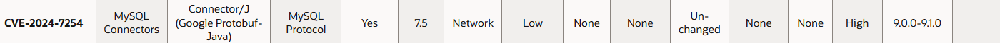

# Práctica 3. Analizar dependencias y librerias del microservicio cliente usando Snyk y OWASP Dependency Check  

En este labatorio se espera que los alumnos puedan revisar la salud de las dependencias de su Microservicio usando **Snyk y OWASP dependency check.**

## Objetivos de la práctica:
- Usar **Snyk** para escanear el proyecto y buscar vulnerabilidades en sus dependencias. 
- Usar **OWASP dependency check** para buscar vulnerabilidades en las dependencias del **pom.xml**. 

## Duración aproximada:
- 40 minutos.

---

<div style="width: 400px;">
        <table width="50%">
            <tr>
                <td style="text-align: center;">
                    <a href="../Capitulo3/"></a>
                    <br>anterior
                </td>
                <td style="text-align: center;">
                   <a href="../README.md">Lista Laboratorios</a>
                </td>
<td style="text-align: center;">
                    <a href="../Capitulo5/"></a>
                    <br>siguiente
                </td>
            </tr>
        </table>
</div>

---


## Diagrama


## Instrucciones
Esta práctica se divide en las siguientes secciones:

- **[Análisis de dependencias usando Snyk](#análisis-de-dependencias-usando-snyk-return)**

- **[Análisis de dependencias usando OWASP dependency Check](#análisis-de-dependencias-usando-owasp-dependency-check-return)**


## Análisis de dependencias usando Snyk [return](#instrucciones)
> **IMPORTANTE:** Se necesita tu cuenta de Snyk del laboratorio **Análisis de seguridad y códificación de un API Rest Spring Boot** en caso de que no se tenga, es necesario regresar al laboratorio anterior y seguir las instrucciones de cómo obtenerla. 

1. Abre **Visual Studio Code.**
2. Abre el proyecto del **MicroservicioCliente.** 
3. Valida que se tenga instalada la extensión **Snyk Security.** 


4. En la barra lateral de VSCode pulsa el icóno de **Snyk.**


5. Realiza un nuevo escaneo, tomando especial cuidado en la sección **Open Source Security.**


6. Se advierte que existe una dependencia con un problema de seguridad. Al darle clic abrirá una nueva ventana con la ubicación de la dependencia con el problema y la información del problema de seguridad. 


7. La herramienta nos alerta que la dependencia de **MySQL Driver** tiene un problema. 

8. Abre la página de Oracle para analizar con mayor detenimiento el problema. El problema es el siguiente:



> **NOTA:** Este problema de seguridad significa que un atacante se podría conectar a nuestro servidor de MySQL sin la necesidad  de escribir la contraseña (esto sucedia en versiones antiguas de MySQL).

9. Ahora... 쮻ebería asustarme esta situación?. La respuesta corta es no, siempre y cuando se tomen precauciones cómo:
- Ocultar la información de la base de datos de mi app.
- Restringir el acceso en nuestra base de datos sólo a las ips necesarias. 
- Usar **VPN o SSH tunnel** para conectarse a la base de datos.
- Tener la base de datos en una conexión privada. 

10. Por el momento, nuestra aplicación no requiere de una modificación a nivel de dependencia, pero si es importante tomar precauciones. 

## Análisis de dependencias usando OWASP Dependency Check [return](#instrucciones)

OWASP Dependency Check es una herramienta **opensource** que usa una base de datos de seguridad llamada **[National Vulnerability Database](https://nvd.nist.gov/developers/request-an-api-key)**, en nuestro proyecto no es necesario obtener el api key. 

1. Abre el proyecto del **Microservicio Cliente.** 
2. Abre el archivo **pom.xml**.

> **IMPORTANTE:** Este archivo es muy delicado, es importante tener especial cuidado al modificarlo. 

3. Modifica el **pom.xml**

```xml
<?xml version="1.0" encoding="UTF-8"?>
<project xmlns="http://maven.apache.org/POM/4.0.0" xmlns:xsi="http://www.w3.org/2001/XMLSchema-instance"
	xsi:schemaLocation="http://maven.apache.org/POM/4.0.0 https://maven.apache.org/xsd/maven-4.0.0.xsd">
	<modelVersion>4.0.0</modelVersion>
	<parent>
		<groupId>org.springframework.boot</groupId>
		<artifactId>spring-boot-starter-parent</artifactId>
		<version>3.4.4</version>
		<relativePath/> <!-- lookup parent from repository -->
	</parent>
	<groupId>com.netec</groupId>
	<artifactId>microserviceclient</artifactId>
	<version>0.0.1-SNAPSHOT</version>
	<name>microserviceclient</name>
	<description>Demo project for Spring Boot</description>
	<url/>
	<licenses>
		<license/>
	</licenses>
	<developers>
		<developer/>
	</developers>
	<scm>
		<connection/>
		<developerConnection/>
		<tag/>
		<url/>
	</scm>
	<properties>
		<java.version>17</java.version>
	</properties>
	<dependencies>
		<dependency>
			<groupId>org.springframework.boot</groupId>
			<artifactId>spring-boot-starter-data-jpa</artifactId>
		</dependency>
		<dependency>
			<groupId>org.springframework.boot</groupId>
			<artifactId>spring-boot-starter-web</artifactId>
		</dependency>

		<dependency>
			<groupId>org.springframework.boot</groupId>
			<artifactId>spring-boot-devtools</artifactId>
			<scope>runtime</scope>
			<optional>true</optional>
		</dependency>
		<dependency>
			<groupId>com.mysql</groupId>
			<artifactId>mysql-connector-j</artifactId>
			<scope>runtime</scope>
		</dependency>
		<dependency>
			<groupId>org.springframework.boot</groupId>
			<artifactId>spring-boot-starter-test</artifactId>
			<scope>test</scope>
		</dependency>
	</dependencies>

	<build>
		<plugins>
			<plugin>
				<groupId>org.springframework.boot</groupId>
				<artifactId>spring-boot-maven-plugin</artifactId>
			</plugin>

			<!-- 🔐 OWASP Dependency-Check Plugin -->
		<plugin>
			<groupId>org.owasp</groupId>
			<artifactId>dependency-check-maven</artifactId>
			<version>12.1.0</version> <!-- Podés verificar si hay versión más reciente -->
			<executions>
				<execution>
					<goals>
						<goal>check</goal>
					</goals>
				</execution>
			</executions>
			<configuration>
				<failBuildOnCVSS>7</failBuildOnCVSS>
				<formats>
					<format>HTML</format>
					<format>JSON</format>
				</formats>
			</configuration>
		</plugin>
		</plugins>
	</build>

</project>
```

4. Abre una nueva terminal de Visual Studio Code y ejecuta el siguiente comando: 

```bash
.\mvnw org.owasp:dependency-check-maven:check
```


5. Abre la ruta **target** y busca el archivo **html**, **dependency-check-report.html**.


6. En esta herramienta no hay vulnerabilidades encontradas en **OWASP Dependency Check**. 

> **NOTA:** Esto no es malo pero si hay que tenerlo en cuenta al usar más de una herramienta de análisis.


## Resultado esperado [Instrucciones](#instrucciones)

Se espera que el alumno tengan 2 informes, uno de Synk y otro de Dependency Check.


