# Práctica 4. Gestión de secretos con Azure Keyvault del Microservicio Cliente

Es necesario proteger los datos de la base de datos y no almacenarlos en el microservicios cómo método de seguridad, para realizar esto usaremos **Azure Key Vault** para la protección de la información. 


## Objetivos
- Configurar un registro de aplicación en el directorio activo de Azure. 
- Crear y configurar un **Azure Key Vault.**
- Conectar nuestro **Microservicio Cliente** a Azure Key Vault para obtener la información de la base de datos. 


---

<div style="width: 400px;">
        <table width="50%">
            <tr>
                <td style="text-align: center;">
                    <a href="../Capitulo4/"></a>
                    <br>anterior
                </td>
                <td style="text-align: center;">
                   <a href="../README.md">Lista Laboratorios</a>
                </td>
<td style="text-align: center;">
                    <a href="../Capitulo6/"></a>
                    <br>siguiente
                </td>
            </tr>
        </table>
</div>

---

## Diagrama

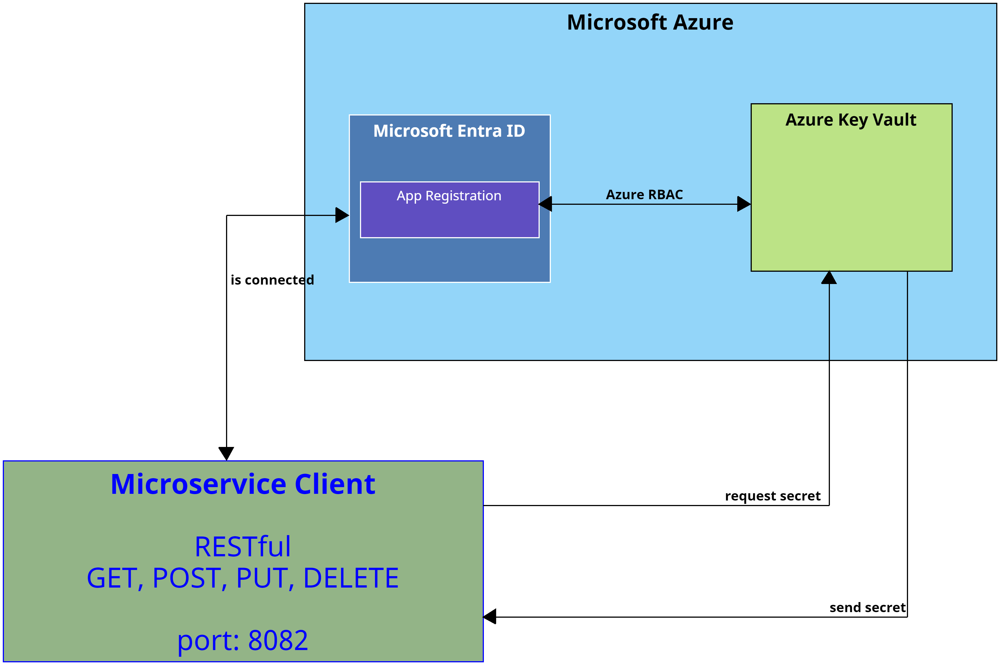

## Instrucciones
Este lab esta separado en las siguientes secciones:

- **[App Registration en Azure](#app-registration-en-azure-return)**
- **[Configuración Azure Key Vault](#configuración-azure-key-vaultreturn)**
- **[Configuración Microservicio Cliente](#configuración-microservicio-cliente-return)**


## App Registration en Azure [return](#instrucciones)
> **IMPORTANTE:** Para esta sección necesitaremos una cuenta de **Microsoft Azure** para la creación y configuración de los recursos, la cuenta debe de tener el rol de **Application Administrator** y los permisos para asignar nuevos roles a recursos de Azure. 

1. Abrir el portal de azure **https://portal.azure.com/**.
2. Iniciar sesión con tu cuenta de Azure.
3. En la barra de busqueda del portal de Azure escribir **Microsoft Entra ID.**

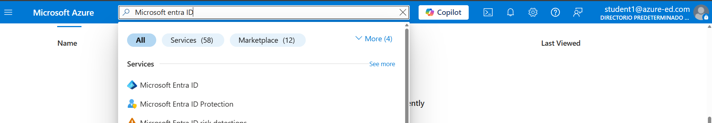

4. En **Microsoft Entra ID** buscar **App Registrations** en la sección de **Manage.**

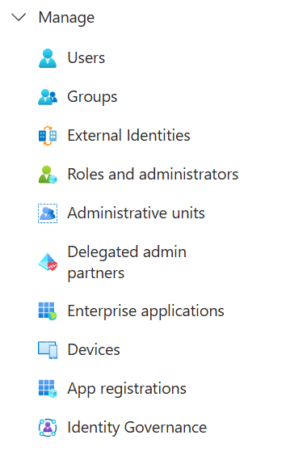

5. Crear un nuevo registro de aplicación en **+ New registration**. 

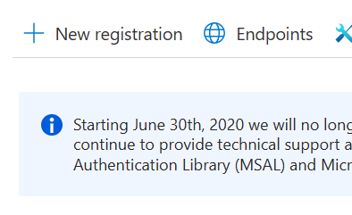

6. Añadir los siguientes datos al registro de la aplicación. 

- **Name:** claseapp**tusiniciales**
- **Supported account types:**  Accounts in this organizational directory only
- **Redirect URI**: Web

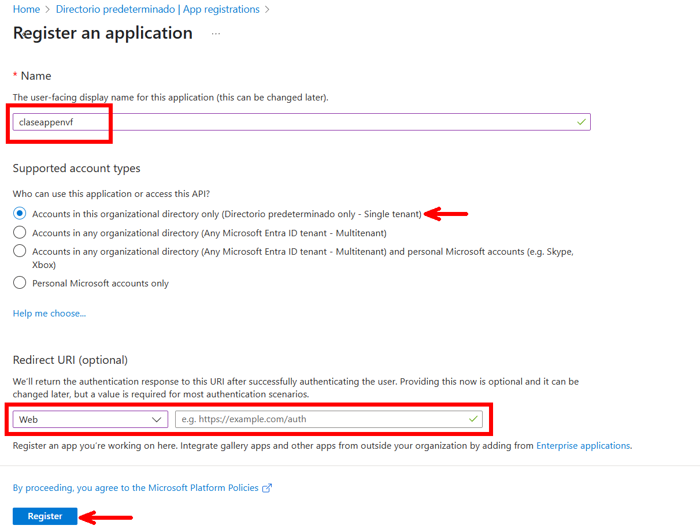

7. Al crear el registro de la aplicación en la pestaña de **Overview** vamos a obtener los siguientes datos (almacenar estos datos en un **notepad**): 

- **Application (client) ID**
- **Directory (tenant) ID**

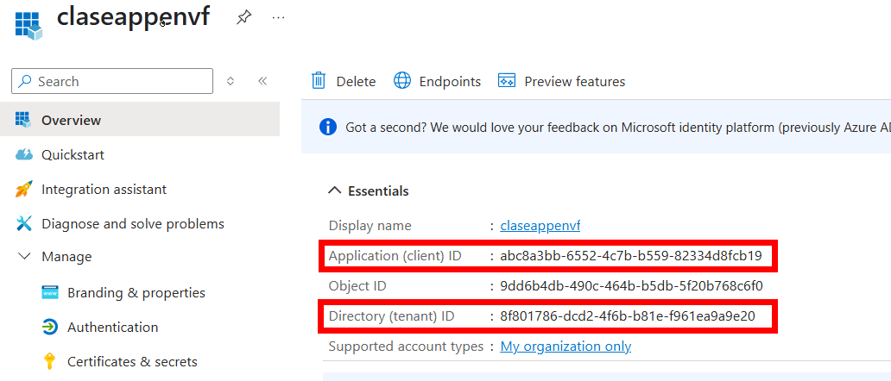

8. Generar un secreto navegando en **Manage->Certificates & Secrets.**

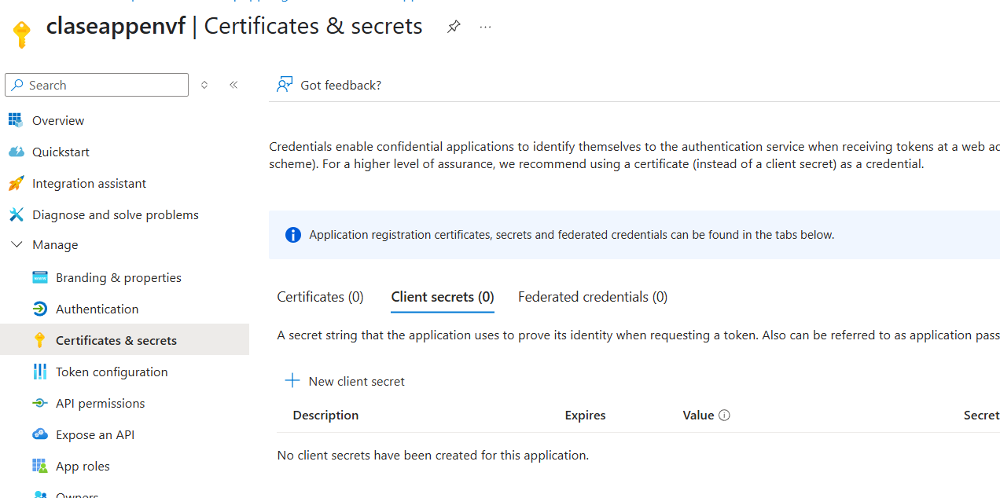

9. El secreto tendrá la siguiente configuración:

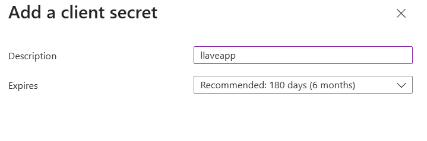

10. Al generar el secreto nos generará un valor. **Si no copiamos este valor va a desaparecer y no lo podremos recuperar.**

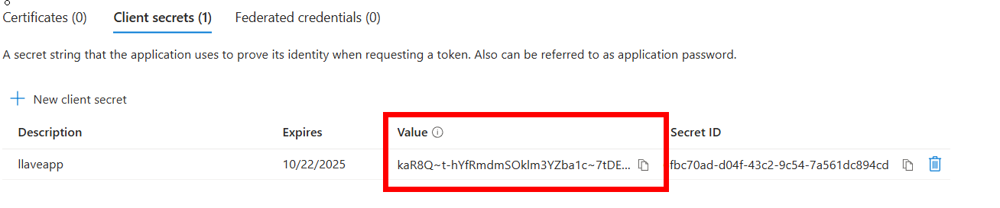

11. Almacenar el secreto en el notepad donde tenemos el client id y tenant id. 

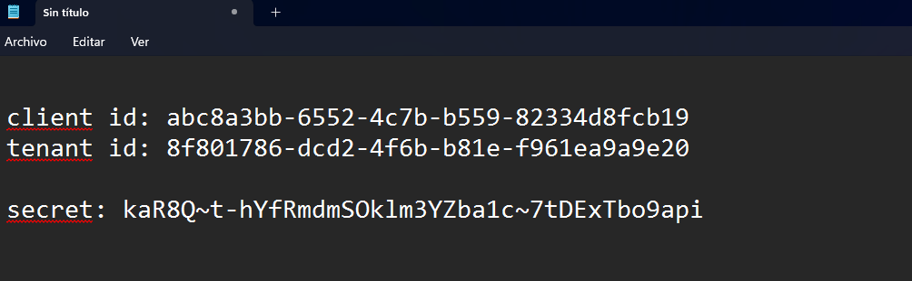

## Configuración Azure Key Vault[return](#instrucciones)
1. Abrir el portal de azure **https://portal.azure.com**.

2. En la barra de búsqueda escribir **Resource Groups**.

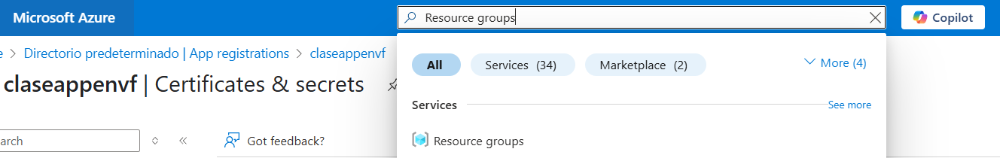

3. Si no se cuenta con un grupo de recursos, crear uno.

4. En el grupo de recursos crear un nuevo recurso **+Create**.

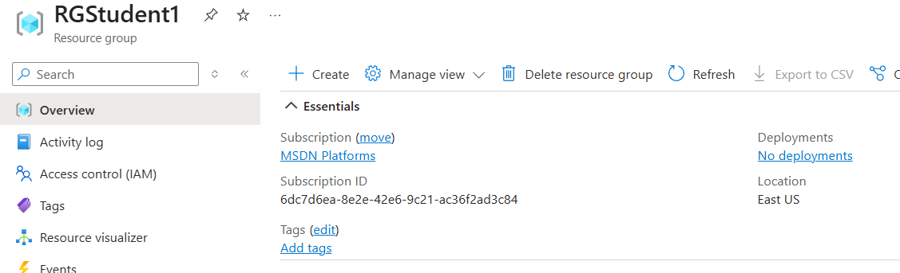

5. Buscar **Key Vault**.

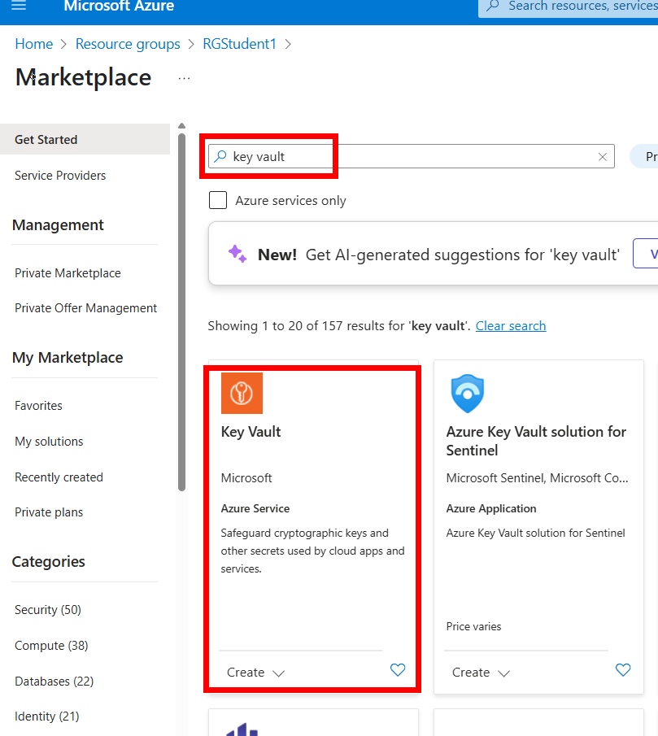

6. Para la configuración del key vault, usaremos la siguiente: 

- **Subscription:** *suscripción que puedas usar para crear recursos.*

- **Resource Group:** *Grupo de recursos disponible (si no hay crear uno nuevo).*

- **Key vault name:** *keyvault**tusiniciales***

- **Region:** East US

- **Pricing tier:** Standard

- **Todas las demás opciones se dejan por default; pulsar review + create**.

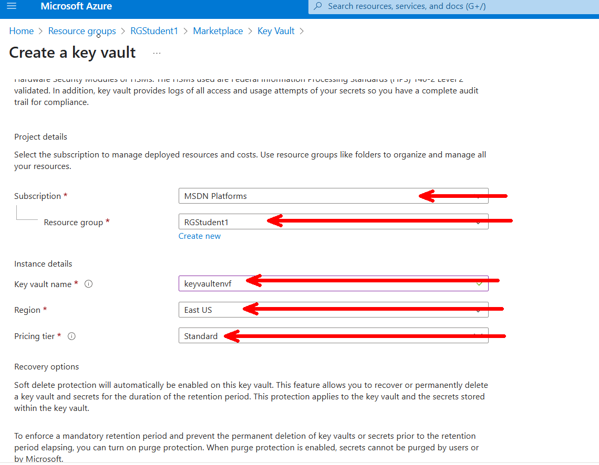

7. Abrir el **Azure Key Vault** creado y abrir la opción **Access control IAM** (añadir 2 roles).
- **Rol 1: KeyVault Adminstrator**: Este rol se le agrega a nuestra cuenta de Azure, esto permite que podamos administrar la herramienta y agregar información.

- **Rol 2: Key Vault Secrets User**: Este rol se le agrega a nuestra aplicación registrada en Azure y permite que nuestra app pueda obtener los secretos de **Azure Key Vault**. 


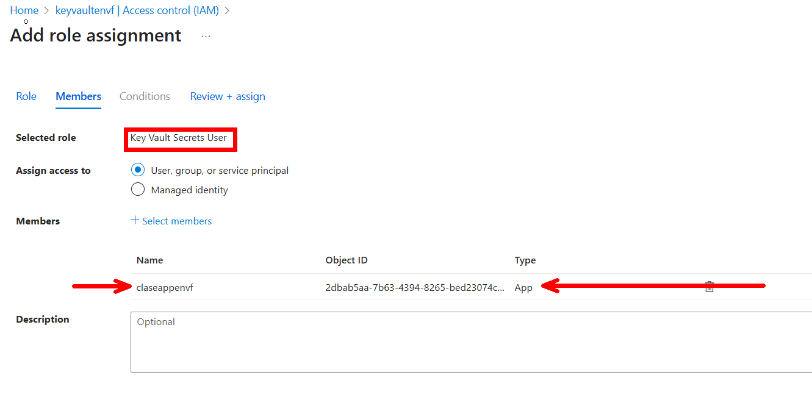

8. En la opción de **Overview** de Azure Key Vault vamos a copiar **Vault URI** y lo almacenaremos en nuestro notepad.

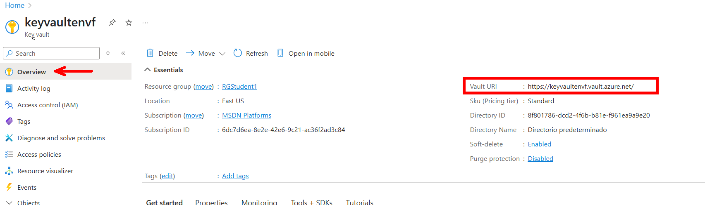

9. Ahora, dirigirse a la sección de **Objects->Secrets**.

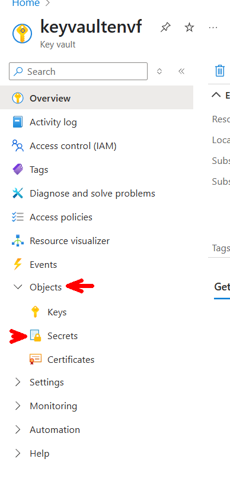

10. Generar 2 secretos: 
- **db-user**: root
- **db-password**: 1234 

> **NOTA:** Estos valores cambiarán conforme cambie la base de datos. 

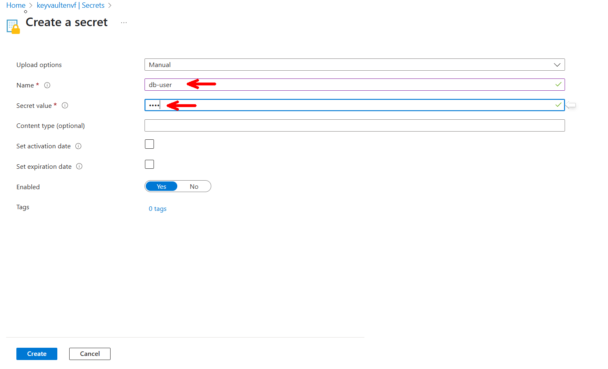

11. Validar que los 2 secretos se hayan creado. 

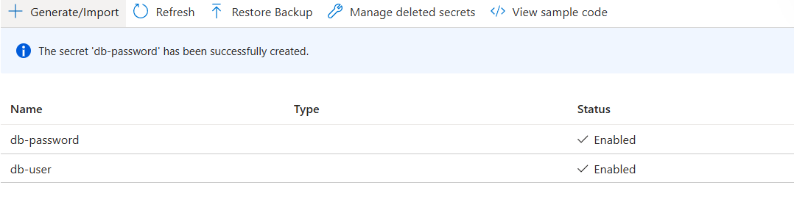

12. Fin de la configuración **Azure Key Vault**. Antes de pasar a la siguiente sección asegurate que en tu notepad tengas la siguiente información:

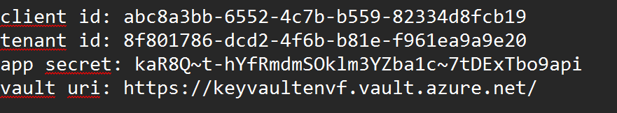


## Configuración Microservicio Cliente [return](#instrucciones)

1. Abrir en Visual Studio Code tu **Microservicio Client**.

2. Modificar tu archivo **pom.xml** con el siguiente contenido: 

```xml
<?xml version="1.0" encoding="UTF-8"?>
<project xmlns="http://maven.apache.org/POM/4.0.0" xmlns:xsi="http://www.w3.org/2001/XMLSchema-instance"
	xsi:schemaLocation="http://maven.apache.org/POM/4.0.0 https://maven.apache.org/xsd/maven-4.0.0.xsd">
	<modelVersion>4.0.0</modelVersion>
	<parent>
		<groupId>org.springframework.boot</groupId>
		<artifactId>spring-boot-starter-parent</artifactId>
		<version>3.4.4</version>
		<relativePath/> <!-- lookup parent from repository -->
	</parent>
	<groupId>com.netec</groupId>
	<artifactId>microserviceclient</artifactId>
	<version>0.0.1-SNAPSHOT</version>
	<name>microserviceclient</name>
	<description>Demo project for Spring Boot</description>
	<url/>
	<licenses>
		<license/>
	</licenses>
	<developers>
		<developer/>
	</developers>
	<scm>
		<connection/>
		<developerConnection/>
		<tag/>
		<url/>
	</scm>
	<properties>
		<java.version>17</java.version>
	</properties>
	<dependencies>
		<dependency>
			<groupId>org.springframework.boot</groupId>
			<artifactId>spring-boot-starter-data-jpa</artifactId>
		</dependency>
		<dependency>
			<groupId>org.springframework.boot</groupId>
			<artifactId>spring-boot-starter-web</artifactId>
		</dependency>
		<dependency>
			<groupId>com.azure.spring</groupId>
			<artifactId>spring-cloud-azure-starter-keyvault-secrets</artifactId>
			<version>5.22.0</version>
		</dependency>

		<dependency>
			<groupId>org.springframework.boot</groupId>
			<artifactId>spring-boot-devtools</artifactId>
			<scope>runtime</scope>
			<optional>true</optional>
		</dependency>
		<dependency>
			<groupId>com.mysql</groupId>
			<artifactId>mysql-connector-j</artifactId>
			<scope>runtime</scope>
		</dependency>
		<dependency>
			<groupId>org.springframework.boot</groupId>
			<artifactId>spring-boot-starter-test</artifactId>
			<scope>test</scope>
		</dependency>
	</dependencies>

	<build>
		<plugins>
			<plugin>
				<groupId>org.springframework.boot</groupId>
				<artifactId>spring-boot-maven-plugin</artifactId>
			</plugin>

			<!-- 🔐 OWASP Dependency-Check Plugin -->
		<!--
		<plugin>
			<groupId>org.owasp</groupId>
			<artifactId>dependency-check-maven</artifactId>
			<version>12.1.0</version> 
			<executions>
				<execution>
					<goals>
						<goal>check</goal>
					</goals>
				</execution>
			</executions>
			<configuration>
				<failBuildOnCVSS>7</failBuildOnCVSS>
				<formats>
					<format>HTML</format>
					<format>JSON</format>
				</formats>
			</configuration>
		</plugin> -->
		</plugins>
	</build>
</project>
```

3. Esperar que el archivo **pom.xml** termine de configurarse.

4. Abrir el archivo **application.properties** que se encuentra en **src->main->resources** y modificarlo con el siguiente contenido: 

```properties
spring.application.name=micro-client
server.port=8082

#hibernate config
spring.jpa.properties.hibernate.dialect=org.hibernate.dialect.MySQLDialect
spring.jpa.hibernate.ddl-auto=update

#configuration azure key vault
spring.cloud.azure.credential.client-id=<client id>
spring.cloud.azure.credential.client-secret=<app secret>
spring.cloud.azure.profile.tenant-id=<tenant id>
spring.cloud.azure.keyvault.secret.property-sources[0].endpoint=<vault uri>

#datasource
spring.datasource.url=jdbc:mysql://localhost:3306/datab
spring.datasource.username=${db-user}
spring.datasource.password=${db-password}
```
5. Del archivo **aplication.properties** modificar **\<client id\>, \<tenant id\> \<app secret\> y \<vault uri\>** con los valores que tenemos en el notepad.

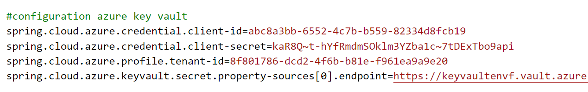

6. Iniciar la aplicación y validar que continue funcionando. No se alteró el funcionamiento de la aplicación, lo que modificamos es que ahora el usuario y contraseña de la base de datos se obtiene desde **Key vualt**.

## Resultado esperado 
Si hemos llegado hasta aqui el alumno debería de poder ejecutar las operaciones del microservicio sin ningún problema. 

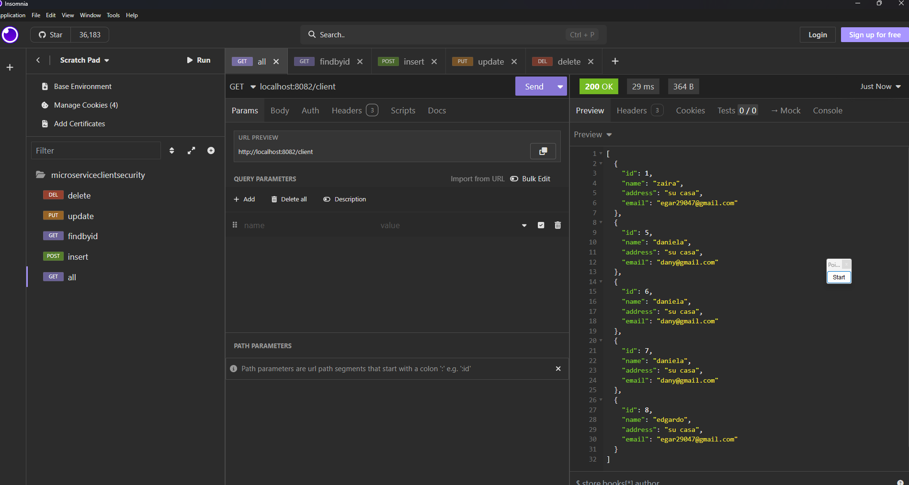
