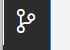

# Práctica 5. Añadir seguridad en CI/CD para el microservicio cliente
Para automatizar la construcción, pruebas y liberación del proyecto, es necesario crear un CI/CD usando github actions. Aunque nos centraremos más en las pruebas de seguridad de nuestro proyecto. 


## Objetivos de la práctica:
- Configurar un repositorio en GitHub.
- Sincronizar nuestro microservicio cliente con el repositorio remoto.
- Crear un CI/CD con pruebas de seguridad para validar automaticamente el código del microservicio. 

## Duración aproximada:
- 60 minutos.

---
<div style="width: 400px;">
        <table width="50%">
            <tr>
                <td style="text-align: center;">
                    <a href="../Capitulo5/"></a>
                    <br>Anterior
                </td>
                <td style="text-align: center;">
                   <a href="https://netec-mx.github.io/DEVSECOPS_JAV/">Lista Laboratorios</a>
                </td>
<td style="text-align: center;">
                    <a href="../Capitulo7/"></a>
                    <br>Siguiente
                </td>
            </tr>
        </table>
</div>

---

## Diagrama


> **IMPORTANTE:** Antes de comenzar este laboratorio necesitas tener una cuenta de **Github gratuita**, y una cuenta de **Docker hub**, en el caso de no tenerlas es necesario obtenerlas en los siguientes enlaces **[Github Free account](https://github.com/)** y **[Docker hub Free account](https://hub.docker.com/)**


## Instrucciones
Esta práctica se divide en las siguientes secciones:

- **[Configuración repositorio en github](#configuración-repositorio-en-github-return)**

- **[Configuración microservicio cliente](#configuración-microservicio-cliente-return)**

- **[Crear GitHub Action](#crear-github-action-return)**

- **[Validar GitHub Action](#validar-github-action-return)**

## Configuración del repositorio en GitHub [return](#instrucciones).

1. Crea un nuevo repositorio en GitHub con los siguientes datos:
   
- **repository name:** repomicroservice
- **Public:** checked
- **Las demás opciones por default**


2.  Al crear el repositorio nos mostrará algunos comandos importantes. Copia el comando que comience con **git remote add origin url_repositorio** y activa **HTTPS**.


3. Fin de la configuración del repositorio remoto. 

## Configuración microservicio cliente [return](#instrucciones)

> **IMPORTANTE:** Para esta sección es fundamental tener instalado **git**, en el caso de no tenerlo, descargarlo de la siguiente ruta **[git download](https://git-scm.com/downloads)**

1. Abre el microservicio cliente en **Visual Studio Code.**

2. Modifica el archivo **pom.xml** con el siguiente comando:

```xml
<?xml version="1.0" encoding="UTF-8"?>
<project xmlns="http://maven.apache.org/POM/4.0.0" xmlns:xsi="http://www.w3.org/2001/XMLSchema-instance"
	xsi:schemaLocation="http://maven.apache.org/POM/4.0.0 https://maven.apache.org/xsd/maven-4.0.0.xsd">
	<modelVersion>4.0.0</modelVersion>
	<parent>
		<groupId>org.springframework.boot</groupId>
		<artifactId>spring-boot-starter-parent</artifactId>
		<version>3.4.4</version>
		<relativePath/> <!-- lookup parent from repository -->
	</parent>
	<groupId>com.netec</groupId>
	<artifactId>microserviceclient</artifactId>
	<version>0.0.1-SNAPSHOT</version>
	<name>microserviceclient</name>
	<description>Demo project for Spring Boot</description>
	<url/>
	<licenses>
		<license/>
	</licenses>
	<developers>
		<developer/>
	</developers>
	<scm>
		<connection/>
		<developerConnection/>
		<tag/>
		<url/>
	</scm>
	<properties>
		<java.version>17</java.version>
	</properties>
	<dependencies>
		<dependency>
			<groupId>org.springframework.boot</groupId>
			<artifactId>spring-boot-starter-data-jpa</artifactId>
		</dependency>
		<dependency>
			<groupId>org.springframework.boot</groupId>
			<artifactId>spring-boot-starter-web</artifactId>
		</dependency>

		<!--Aqui se agrega la dependencia original -->
		<dependency>
			<groupId>com.azure.spring</groupId>
			<artifactId>spring-cloud-azure-starter-keyvault-secrets</artifactId>
			<version>5.21.0</version>
			<exclusions>
				<exclusion>
					<groupId>com.azure</groupId>
					<artifactId>azure-identity</artifactId>
				</exclusion>
			</exclusions>
	</dependency>

	<!-- Agregar la versión corregida -->
	<dependency>
		<groupId>com.azure</groupId>
		<artifactId>azure-identity</artifactId>
		<version>1.15.4</version> <!-- O más reciente -->
	</dependency>

		

		<dependency>
			<groupId>org.springframework.boot</groupId>
			<artifactId>spring-boot-devtools</artifactId>
			<scope>runtime</scope>
			<optional>true</optional>
		</dependency>
		<dependency>
			<groupId>com.mysql</groupId>
			<artifactId>mysql-connector-j</artifactId>
			<scope>runtime</scope>
		</dependency>
		<dependency>
			<groupId>org.springframework.boot</groupId>
			<artifactId>spring-boot-starter-test</artifactId>
			<scope>test</scope>
		</dependency>
	</dependencies>

	<build>
		<plugins>
			<plugin>
				<groupId>org.springframework.boot</groupId>
				<artifactId>spring-boot-maven-plugin</artifactId>
			</plugin>

			<!-- 🔐 OWASP Dependency-Check Plugin -->
		
		<plugin>
			<groupId>org.owasp</groupId>
			<artifactId>dependency-check-maven</artifactId>
			<version>12.1.0</version> 
			<executions>
				<execution>
					<goals>
						<goal>check</goal>
					</goals>
				</execution>
			</executions>
			<configuration>
				<failBuildOnCVSS>7</failBuildOnCVSS>
				<formats>
					<format>HTML</format>
					<format>JSON</format>
				</formats>
				<suppressionFiles>
                  <suppressionFile>./suppression.xml</suppressionFile>
                </suppressionFiles>
			</configuration>
		</plugin> 
		</plugins>
	</build>

</project>

```

3. En la raíz de nuestro proyecto crea un archivo llamado **suppression.xml** y agrega el siguiente contenido:

```xml
<?xml version="1.0" encoding="UTF-8"?>
<suppressions xmlns="https://jeremylong.github.io/DependencyCheck/dependency-suppression.1.3.xsd">
 <suppress>
   <notes><![CDATA[
   file name: azure-identity-1.15.4.jar
   ]]></notes>
   <packageUrl regex="true">^pkg:maven/com\.azure/azure-identity@.*$</packageUrl>
   <cve>CVE-2023-36415</cve>
</suppress>
</suppressions>
```

3.1 Modifica el archivo **application.properties**.

```properties
spring.application.name=micro-client
server.port=8082

#hibernate config
spring.jpa.properties.hibernate.dialect=org.hibernate.dialect.MySQLDialect
spring.jpa.hibernate.ddl-auto=update

#configuration azure key vault
spring.cloud.azure.credential.client-id=${CLIENT_ID}
spring.cloud.azure.credential.client-secret=${APP_SECRET}
spring.cloud.azure.profile.tenant-id=${TENANT_ID}
spring.cloud.azure.keyvault.secret.property-sources[0].endpoint=https://keyvaultenvf.vault.azure.net/

#datasource
spring.datasource.url=jdbc:mysql://${DB_IP:localhost}:${DB_PORT:3306}/${DB_NAME:datab}
spring.datasource.username=${db-user}
spring.datasource.password=${db-password}
```

3.2 Agrega un archivo llamado **Dockerfile** en la raíz del proyecto y añade el siguiente contenido:

```Dockerfile
FROM openjdk:17
WORKDIR /app
COPY target/microserviceclient-0.0.1-SNAPSHOT.jar client.jar
EXPOSE 8082
ENTRYPOINT [ "java","-jar","client.jar" ]
```

4. Busca en la barra lateral de **VSCode** el icono de git. 



5. Pulsa el botón **Initialize repository.**


6. Agrega todos los cambios al repositorio usando el símbolo de **+** en la opción de **changes**.


7. Añade un mensaje al **commit** y pulsa el botón **commit**.


8. Abre una terminal en el microservicio cliente en **VSCode**. 

9. Ejecuta el comando copiado del repositorio de **GitHub**.

```bash
git remote add origin <URI git repository>
```

10. Ejecuta el comando que nos permitira sincronizar el microservicio cliente: 

```bash
git push --set-upstream origin main
```

> **IMPORTANTE:** Este comando nos pedirá iniciar sesión con nuestra cuenta de GitHub, debemos de iniciar y esperar a que nuestro proyecto se cargue. 

11. Valida que el código de tu microservicio este cargado en **GitHub.** 


## Crear GitHub Action [return](#instrucciones)

1. En el repositorio de **GitHub** donde se encuentra tu **Microservicio cliente** busca la sección **Actions.**


2. Selecciona la opción **set up a workflow yourself**.


3. Añade el siguiente flujo YAML, para realizar el CI/CD.

```yaml
name: DevSecOps Microservice Client

on:
  push:
    branches:
      - main

jobs:
  security-scan:
    runs-on: ubuntu-latest
    env:
      SONAR_TOKEN: ${{ secrets.SONAR_TOKEN }}
    steps:
      - name: Checkout Code
        uses: actions/checkout@v4

      - name: Set up JDK 17
        uses: actions/setup-java@v4
        with:
          distribution: 'temurin'
          java-version: '17'
      - name: Cache Maven packages
        uses: actions/cache@v4
        with:
          path: ~/.m2
          key: ${{ runner.os }}-maven-${{ hashFiles('**/pom.xml') }}
          restore-keys: |
            ${{ runner.os }}-maven-

      - name: Cache OWASP Dependency-Check DB
        uses: actions/cache@v4
        with:
          path: ~/.dependency-check
          key: ${{ runner.os }}-owasp-${{ github.run_id }}
          restore-keys: |
            ${{ runner.os }}-owasp-
            

      - name: Build with Maven
        run: mvn clean verify -DskipTests=true

      - name: OWASP Dependency Check
        run: mvn org.owasp:dependency-check-maven:check

      - name: SonarCloud Analysis
        uses: SonarSource/sonarcloud-github-action@v2
        with:
          projectBaseDir: .
          args: >
            -Dsonar.projectKey=claseti
            -Dsonar.organization=netec
            -Dsonar.sources=src/main/java
            -Dsonar.tests=src/test/java
            -Dsonar.java.binaries=target/classes

      - name: Build Docker image #step 4
        run: docker build -t ${{ secrets.DOCKER_USERNAME }}/devsecops:${{ github.sha }} .
        working-directory: .

      - name: Log in to Docker Hub #step 5
        uses: docker/login-action@v3.3.0
        with:
          username: ${{ secrets.DOCKER_USERNAME }}
          password: ${{ secrets.DOCKER_PASSWORD }}

      - name: Push Docker image to Docker Hub #step 6
        run: |
          docker tag ${{ secrets.DOCKER_USERNAME }}/devsecops:${{ github.sha }} ${{ secrets.DOCKER_USERNAME }}/devsecops:microserviceclient
          docker push ${{ secrets.DOCKER_USERNAME }}/devsecops:microserviceclient
```


4. Realiza el **commit**. 
5. Añade los siguientes **secretos** en el repositorio:


## Validar GitHub Action [return](#instrucciones)

1. Ve a la sección de **Actions** en el repositorio.

2. Encuentra el **action** ejecutado correctamente.


3. Abre la cuenta de **Docker Hub** y valida que se haya creado el repositorio con nuestra imagen lista para ser usada en un despliegue. 


## Resultado esperado [Instrucciones](#instrucciones)

Se espera que el alumno al final de la ejecución del flujo pueda observar su imagen en su repositorio de **GitHub**.


