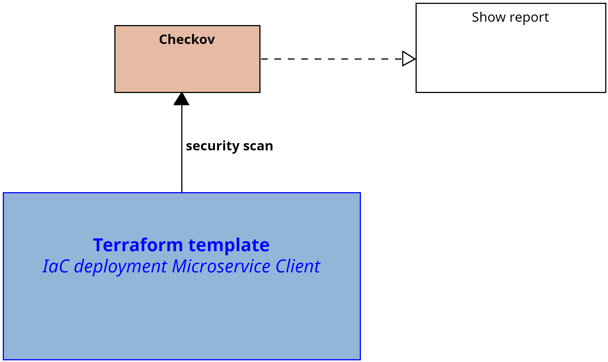
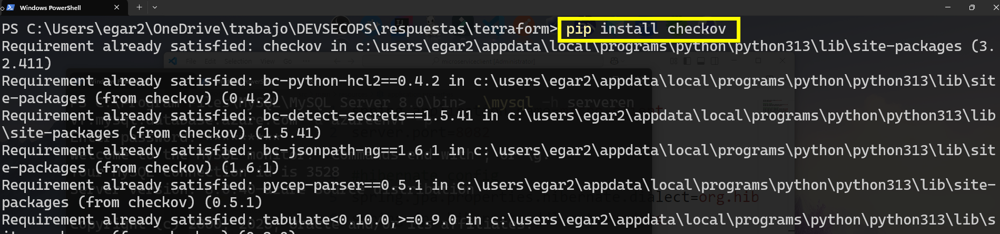
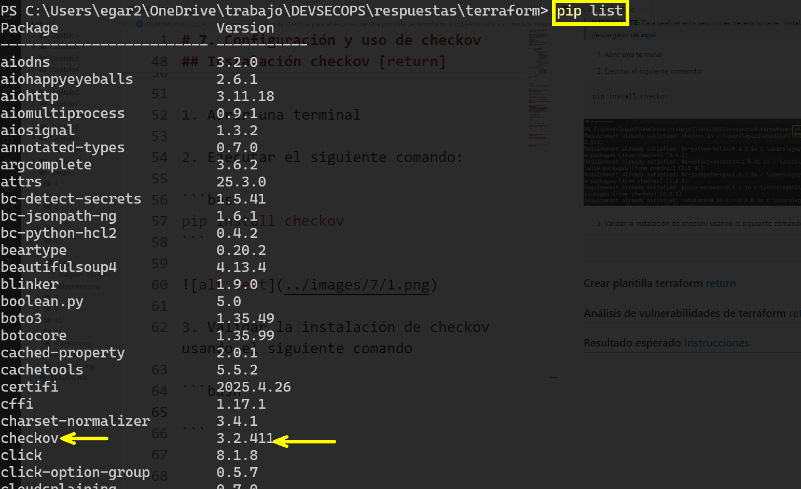
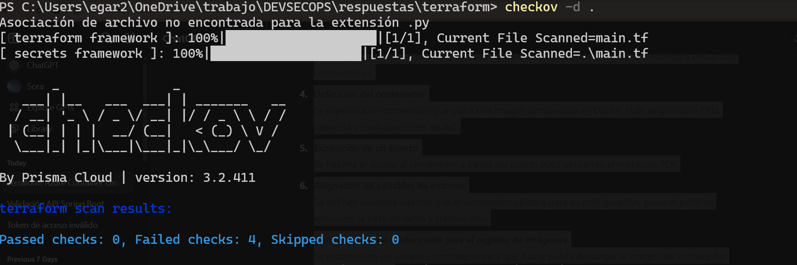
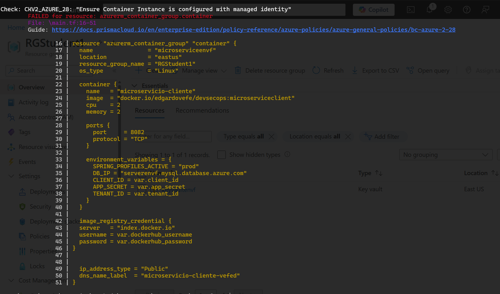

# Práctica 7. Configuración y uso de Checkov para el escaneo de una plantilla de Terraform 

En este laboratorio exploraremos la integración continúa usando Github Actions y el almacenamiento de nuestra imagen Docker en Docker Hub.

## Objetivos de la práctica:
- Installar Checkov.
- Configurar una plantilla de terraform para nuestro microservicio cliente.
- Buscar vulnerabilidades usando Checkov.

## Duración aproximada:
- 40 minutos.

---

<div style="width: 400px;">
        <table width="50%">
            <tr>
                <td style="text-align: center;">
                    <a href="../Capitulo7/"></a>
                    <br>anterior
                </td>
                <td style="text-align: center;">
                   <a href="../README.md">Lista Laboratorios</a>
                </td>
<td style="text-align: center;">
                    <a href="../Capitulo9/"></a>
                    <br>siguiente
                </td>
            </tr>
        </table>
</div>

---


## Diagrama




## Instrucciones
Este laboratorio esta configurado en las siguientes secciones: 

- **[Instalación checkov](#instalación-checkov-return)**

- **[Crear plantilla terraform](#crear-plantilla-terraform-return)**

- **[Análisis de vulnerabilidades de terraform](#análisis-de-vulnerabilidades-de-terraform-return)**


## Instalación checkov [return](#instrucciones)
> **IMPORTANTE:** Para realizar esta sección es necesario tener instalado Python. En el caso de no tenerlo descargarlo de **[aquí](https://www.python.org/downloads/)**

1. Abrir una terminal. 
2. Ejecutar el siguiente comando: 

```bash
pip install checkov
```



3. Validar la instalación de Checkov usando el siguiente comando. 

```bash
pip list
```




## Crear plantilla terraform [return](#instrucciones)

1. Abrir **Visual Studio Code.**
2. Crear una carpeta que llamaremos **terraform.**
3. En la carpeta crearemos un archivo que llamaremos **main.tf**.
4. En el archivo **main.tf** añadiremos el siguiente contenido: 

```json
terraform {
  required_providers {
    azurerm = {
      source  = "hashicorp/azurerm"
      version = "~> 3.100"
    }
  }
}

provider "azurerm" {
  features {}
  subscription_id = "6dc7d6ea-8e2e-42e6-9c21-ac36f2ad3c84"
}


resource "azurerm_container_group" "container" {
  name                = "microserviceenvf"
  location            = "eastus"
  resource_group_name = "RGStudent1"
  os_type             = "Linux"

  container {
    name   = "microservicio-cliente"
    image  = "docker.io/edgardovefe/devsecops:microserviceclient"
    cpu    = 2
    memory = 2

    ports {
      port     = 8082
      protocol = "TCP"
    }

    environment_variables = {
      SPRING_PROFILES_ACTIVE = "prod"
      DB_IP = "serverenvf.mysql.database.azure.com"
      CLIENT_ID = "<client_id>"
      APP_SECRET = "<app_secret>"
      TENANT_ID = "<tenant_id>"
    }
  }

  image_registry_credential {
  server   = "index.docker.io"
  username = "pruebauser"
  password = "pruebaspassword"
}


  ip_address_type = "Public"
  dns_name_label  = "microservicio-cliente-vefed" 
}

```

El anterior archivo de terraform tiene las siguientes actividades:

- Definición de proveedor requerido:
Se indica que se usará el proveedor de Azure (azurerm).

- Configuración del proveedor Azure:
Se establece la conexión a una suscripción de Azure especificando su ID y habilitando las configuraciones necesarias.

- Creación de un grupo de contenedores:
Se configura un servicio de Azure llamado Azure Container Instance, donde se desplegará uno o más contenedores.

- Definición del contenedor:
Se especifica un contenedor que usará una imagen almacenada en Docker Hub, asignándole CPU, memoria y configuraciones de red.

- Exposición de un puerto:
Se habilita el acceso al contenedor a través del puerto 8082 utilizando el protocolo TCP.

- Asignación de variables de entorno:
Se definen variables internas que el contenedor utilizará para su configuración, como el perfil de ejecución, la base de datos y credenciales.

- Configuración de credenciales para el registro de imágenes:
Se proporciona un usuario y contraseña para que Azure pueda descargar la imagen del contenedor desde Docker Hub.

- Asignación de IP pública y DNS:
Se indica que el contenedor tendrá una dirección IP pública accesible desde internet, y se define un nombre DNS para facilitar su acceso.


## Análisis de vulnerabilidades de terraform [return](#instrucciones)
1. Para escanear las vulnerabilidades del archivo de terraform es necesario abrir una terminal en la ruta donde se encuentra el archivo. 

2. Ejecutar el siguiente comando:

```bash
checkov -d .
```



3. Analizar todas las recomendaciones de seguridad que te da Checkov.
4. Para proteger las variables de ambiente y solucionar la mayor parte de errores, crear un archivo con el nombre de **variables.tf** al cual se le añadira el siguiente contenido:

```json
variable "client_id"{
    description = "id cliente app registry"
    type = string
    sensitive = true
}

variable "app_secret"{
    description = "secret app registry"
    type = string
    sensitive = true
}

variable "dockerhub_username" {
  description = "username docker"
  type = string
  sensitive = false
}

variable "dockerhub_password" {
  description = "docker password"
  type = string
  sensitive = true
}

variable "tenant_id" {
  description = "tenant id Azure"
  type = string
  sensitive = true
}
```

5. Añadir otro archivo que llamaremos **terraform.tfvars** donde se agregará el siguiente contenido:

```json
client_id         = "<client_id>"
app_secret        = "<app_secret>"
tenant_id         = "<tenant_id>"
dockerhub_username = "pruebauser"
dockerhub_password = "pruebapassword"
```

6. Escanear nuevamente la plantilla de terraform con el siguiente comando:

```bash
checkov -d . 
```

7. Al realizar el escaneo, el error de **harcording** que se mostraba en los datos de la plantilla de terraform, va a desaparecer.

> **Nota:** Nos van a aparecer otras sugerancias para proteger mucho más nuestra infraestructura cómo código. 


## Resultado esperado [Instrucciones](#instrucciones)

Al final, el alumno podrá observar una pantalla con unas sugerencias cómo la siguiente. 


