# Práctica 8. Análisis de seguridad de Docker y Kubernetes usando Trivy, Checkov y Kubescape
En este laboratorio se espera que el alumno pueda instalar y usar herramientas de análisis de vulnerabilidades para  **Docker Image** y  **Kubernetes**

## Objetivos
- Análisis de vulnerabilidades de la imágen de **Docker** (**Trivy**).
- Despliegue de microservicio en **Kubernetes**.
- Análisis de vulnerabilidades de los **YAML** de Kubernetes (**Trivy**).
- Análisis de vulnerabilidades del clúster de Kubernetes (**kubescape**). 

## Duración aproximada:
- 80 minutos.
  
---

<div style="width: 400px;">
        <table width="50%">
            <tr>
                <td style="text-align: center;">
                    <a href="../Capitulo8/"></a>
                    <br>anterior
                </td>
                <td style="text-align: center;">
                   <a href="../README.md">Lista Laboratorios</a>
                </td>
<td style="text-align: center;">
                    <a href="../Capitulo10/"></a>
                    <br>siguiente
                </td>
            </tr>
        </table>
</div>

---


## Diagrama

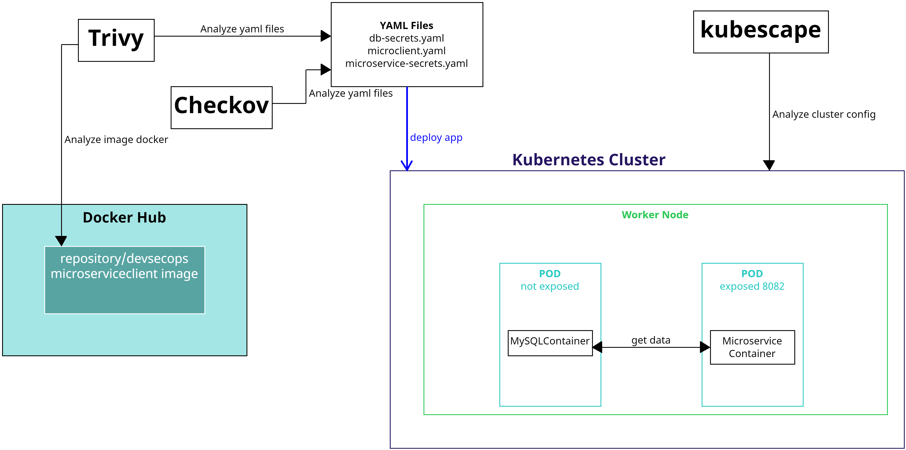


> **IMPORTANTE**: Antes de comenzar el laboratorio asegurate de tener un clúster de Kubernetes
configurado, te recomiendo usar **[Minikube](https://minikube.sigs.k8s.io/docs/start/?arch=%2Fwindows%2Fx86-64%2Fstable%2F.exe+download)** ó puedes usar un clúster en la nube.


## Instrucciones
Esta práctica se divide en las siguientes secciones:

- **[Análisis de vulnerabilidades de una imagen de Docker](#análisis-de-vulnerabilidades-de-una-imagen-de-docker-return)**

- **[Despliegue de microservicio cliente en Kubernetes](#despliegue-de-microservicio-cliente-en-kubernetes-return)**

- **[Análisis de seguridad de los YAML de despliegue usando Trivy y Checkov](#análisis-de-seguridad-de-los-yaml-de-despliegue-usando-trivy-y-checkov-return)**

- **[Análisis de configuración de clúster de kubernetes](#análisis-de-configuración-de-clúster-de-kubernetes-return)**

## Análisis de vulnerabilidades de una imagen de Docker [return](#instrucciones)

> **IMPORTANTE:** Este laboratorio necesita que tengas cargada la imágen de Docker de tu microservicio cliente en **Docker Hub** en el caso de no tenerlo es necesario regresar al laboratorio **Añadir seguridad en CI/CD para el Microservicio Cliente**.

> **IMPORTANTE:** Para este laboratorio es necesario tener instalado el gestor de paquetes **Chocolatey** en el caso de no tenerlo ver las opciones de instalación **[aquí](https://chocolatey.org/install)**

1. Abre una terminal de windows en modo **admninistrador.**
2. Ejecuta el siguiente comando para instalar a **trivy.**

```bash
choco install trivy
```
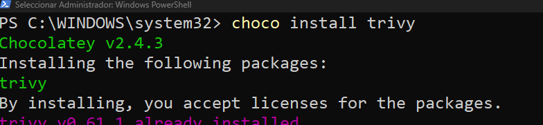

3. Utiliza el siguiente comando para descargar nuestra imagen localmente: 

```bash
docker pull turepositorio/devsecops:microserviceclient
```

4. Valida que la imágen se encuentre localmente: 

```bash
docker image ls
```

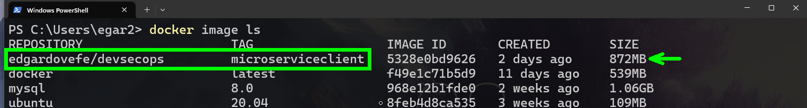

5. Realiza un análisis de seguridad de la imagén donde sólo se muestran las vulnerabilidades altas y criticas:

```
trivy image --severity HIGH,CRITICAL repositorio/devsecops:microserviceclient
```

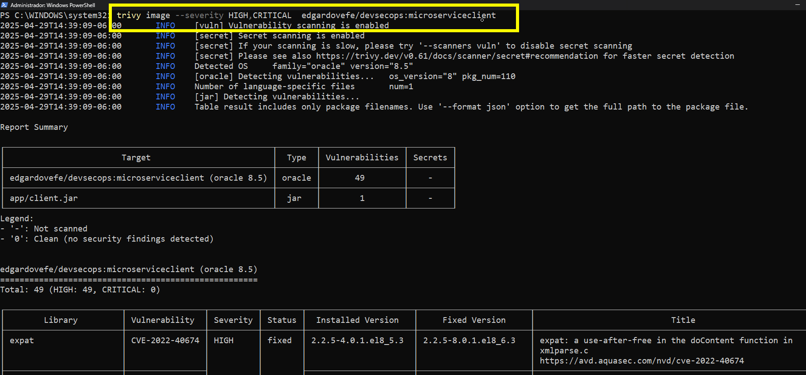


6. Analiza todas las vulnerabilidades. Como podemos notar, existen muchas vulnerabilidades de la imágen base de **openjdk**, para solucionarlo se recomienda lo siguiente:

- Crear nuestra propia imagen personalizada de Java **muchas empresas hacen esto**.
- Sólo exponer los puertos necesarios, de esta forma se minimizan las posibles entradas a nuestro contenedor. 

## Despliegue de microservicio cliente en Kubernetes [return](#instrucciones)
> **IMPORTANTE:** Para esta sección es necesario que se tenga instalado **minikube y kubectl**  en el caso de no tenerlos instalarlos **[minikube installation](https://minikube.sigs.k8s.io/docs/start/)** y **[kubectl installation](https://kubernetes.io/docs/tasks/tools/)**

1. Abre una terminal de Windows. 
2. Ejecuta el siguiente comando para iniciar un clúster de Kubernetes de pruebas:

```bash
minikube start --driver=docker
```
> **IMPORTANTE:** Este comando tardará unos minutos. 

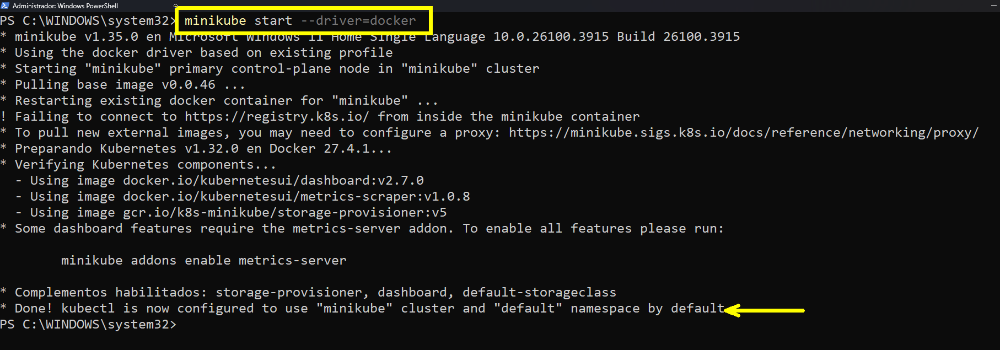

3. Crea una carpeta en el escritorio con el nombre de **kubernetes.** 

4. Abre la carpeta en **VSCode.**

5. Añade los siguientes archivos a la carpeta: 

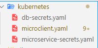

6. En el archivo **db-secrets.yaml**, añade el siguiente contenido: 

```yaml
apiVersion: v1
kind: Secret
metadata:
  name: db-secrets
type: Opaque
data:
  DB_NAME: ZGF0YWRi
  DB_PASSWORD: bmV0ZWMxMjM0
```

> **IMPORTANTE:** El valor de **DB_NAME** y **DB_PASSWORD** estan codificados en **base64**, en caso de que requieras codificar tu valor, usa el siguiente comando: 

```powershell
[Convert]::ToBase64String([Text.Encoding]::UTF8.GetBytes("dato"))
```

7. En el archivo **microservice-secrets.yaml** añade el siguiente contenido: 

```yaml
apiVersion: v1
kind: Secret
metadata:
  name: microservice-secrets
type: Opaque
data:
  CLIENT_ID: <clientid base64>
  APP_SECRET: <appsecret base64>
  TENANT_ID: <tenantid base64>
```

> **IMPORTANTE:** **CLIENT_ID, APP_SECRET Y TENANT_ID** són los valores de tu **app registration** creada anteriormente y también deben estar códificadas en **base64**.

8. En el archivo **microclient.yaml** añade el siguiente contenido: 

```yaml
#.-.-.-.Service and deployment MySQL.-.-.-.
apiVersion: v1
kind: Service
metadata:
  name: mysql-service
spec:
  selector:
    app: mysqlserver
  ports:
  - port: 3306
  clusterIP: None


---

apiVersion: apps/v1
kind: Deployment
metadata:
  name: mysqlserver
spec:
  selector:
    matchLabels:
      app: mysqlserver
  template:
    metadata:
      labels:
        app: mysqlserver
    spec:
      containers:
      - name: container1
        image: mysql:8.0
        env:
          - name: MYSQL_ROOT_PASSWORD
            valueFrom:
              secretKeyRef:
                name: db-secrets
                key: DB_PASSWORD
          - name: MYSQL_DATABASE
            valueFrom:
              secretKeyRef:
                name: db-secrets
                key: DB_NAME

---

# -.-.--.-.-. Service and deployment MicroserviceClient-.-.-.-.-.-.

apiVersion: v1
kind: Service
metadata:
  name: micro-service
spec:
  selector:
    app: client
  ports:
  - port: 8082
    targetPort: 8082
  type: LoadBalancer


---

apiVersion: apps/v1
kind: Deployment
metadata:
  name: client-deployment
spec:
  selector:
    matchLabels:
      app: client
  template:
    metadata:
      labels:
        app: client
    spec:
      containers:
      - name: container
        image: repositorio/devsecops:microserviceclient
        env:
          - name: DB_IP
            value: 'mysql-service.default'
          
          - name: DB_NAME
            valueFrom:
              secretKeyRef:
                name: db-secrets
                key: DB_NAME

          - name: CLIENT_ID
            valueFrom:
              secretKeyRef:
                name: microservice-secrets
                key: CLIENT_ID
          - name: APP_SECRET
            valueFrom:
              secretKeyRef:
                name: microservice-secrets
                key: APP_SECRET
          - name: TENANT_ID
            valueFrom:
              secretKeyRef:
                name: microservice-secrets
                key: TENANT_ID
          
```

> **IMPORTANTE:** En la sección del despliegue del **microservicio cliente**, modificar la imagen de Docker por la tuya. 

9. Abre una terminal en la carpeta de **Kubernetes** y ejecuta el siguiente comando: 

```bash
kubectl apply -f .
```

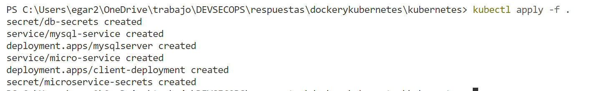

10. Para validar que todo funciona bien, ejecuta el siguiente comando: 

```bash
kubectl get deployments
```

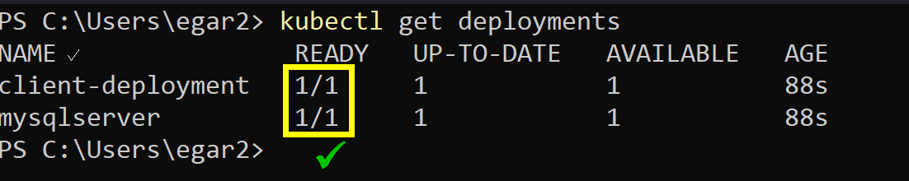

> **NOTA:** El mensaje de READY con un 1 significa que el despliegue y los pods estan funcionando correctamente. 

11. Ejecuta el siguiente comando para probar el microservicio cliente: 

```bash
minikube service micro-service
```

> **NOTA:** El comando anterior nos entrega un URL para poder probar el microservicio fuera del clúster de kubernetes. 

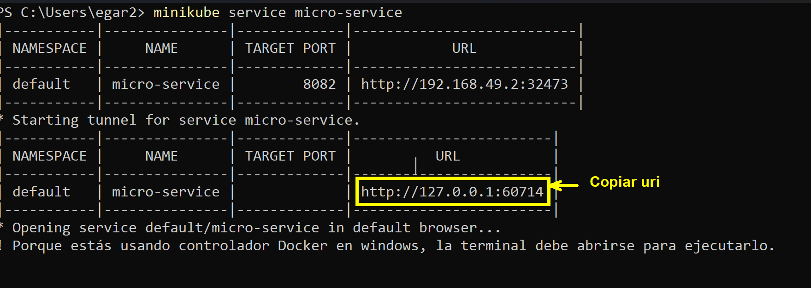

12. Abre postman/insomnia y sustituye **localhost:8082** por el uri copiado. Prueba las operaciones del microservicio.

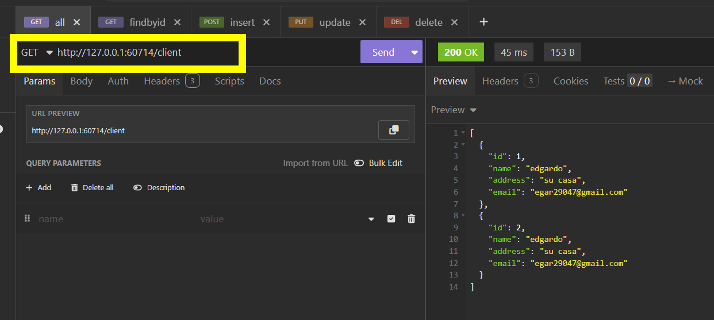


## Análisis de seguridad de los YAML de despliegue usando Trivy y Checkov [return](#instrucciones)

> **IMPORTANTE:** Para esta sección se necesita que se tengan instalado **Trivy** y **Checkov**. 

1. Abre una nueva terminal de Windows.
2. En la terminal, dirígete a la carpeta **Kubernetes** donde se encuentran los **YAMLS** de nuestro microservicio. 

3. Ejecuta el siguiente comando para el análisis de **trivy**:

```bash
trivy config --severity HIGH,CRITICAL .
```

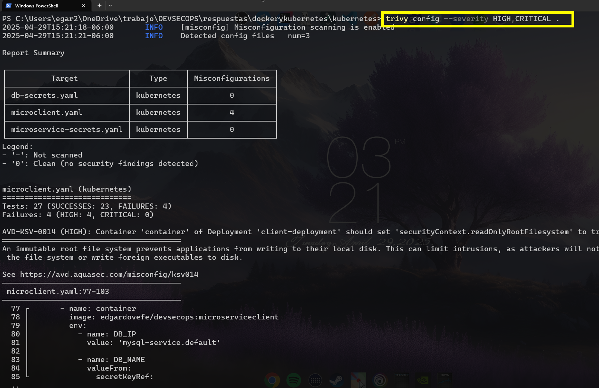

4. Analiza las recomendaciones que nos da y los urls de documentación. 

5. En la terminal, realiza el análisis de Checkov usando el siguiente comando estando en la carpeta de **Kubernetes**: 


```bash
checkov -d . 
```

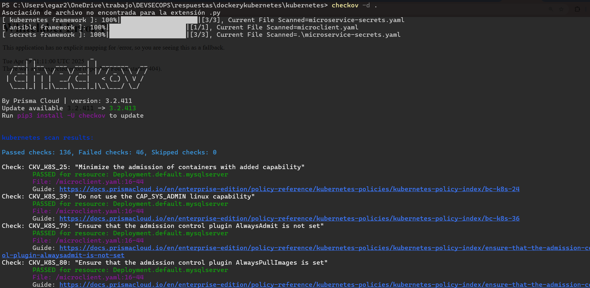

6. Analizar las recomendaciones de seguridad y validar si nos da las mismas con ambas herramientas. 


## Análisis de configuración de clúster de kubernetes [return](#instrucciones)

1. Instala la herramienta Kubescape para el análisis del clúster de Kubernetes. 

```bash
choco install kubescape
```

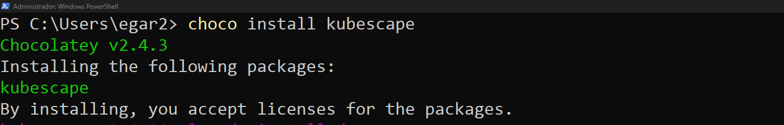

2. Ejecuta el siguiente comando para el análisis de seguridad del clúster de Kubernetes. 

```bash
kubescape scan framework nsa --exclude-namespaces kube-system,kube-public
```

> **NOTA:** El comando anterior nos dice que se analizará el clúster de kubernetes omitiendo los namespaces **kube-system y kube-public.**

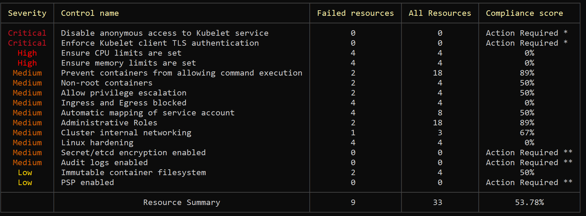

3. Analiza las recomendaciones para el clúster de Kubernetes. 

> **NOTA:** Al ser un clúster de pruebas no es necesario realizar una modificación de los archivo de configuración, pero es importante tomarlas en cuenta en los sistemas de producción. 

## Resultado esperado [instrucciones](#instrucciones)

Al llegar hasta aquí el alumno tendrá 3 informes de seguridad de cada una de las herramientas. 


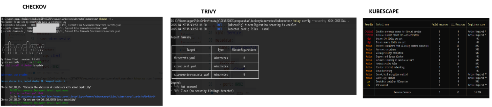


